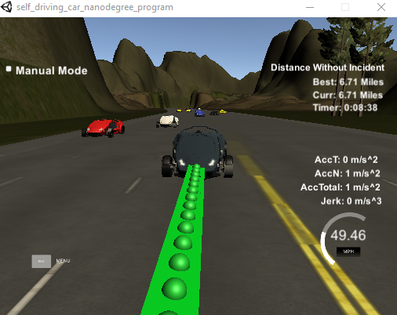

**Path Planning Project**


The goals / steps of this project are the following:

* to keep inside its lane, avoid hitting other cars
* to pass slower moving traffic all by using localization, sensor fusion, and map data.

## [Rubrics Points](https://review.udacity.com/#!/rubrics/1020/view) 

### 1. Statement of the problem
We are supposed to feed the simulator with a set of points per cycle (50 points for every 0.02 s) so that a car gets timely control of velocity on a certain lane. The ego car runs along one of the 3 lanes on the right hand side of the road, and tries to maintain a speed close to the speed limit 50 mph. If there is another car in front of its current lane, it tries to safely move to another lane which can runs faster. It also remains comfortable with acceleration and jerk not too high.

* Input
A highway map provides coordinates of the points at the double yellow line in middle of the highway. The total length is 6946 m. The car starts from the red point and runs anti clock wise. The maps coordinates are given by reading a file.


The ego car's current state (coords in xy and Frenet, yaw, and speed), and the car's previous path, and the environmental cars' states (id, coords in xy and Frenet, and velocity) are fed in by the simulator every cycle.

* Output
A set of points coordinates (next_x_vals and next_y_vals) in the next coming cycle (0.02 s) in xy coordinate system.

## 1. The code compiles correctly.
The code compiles successfully and generate the object file.

## 2. Valid trajectories
### The car is able to drive at least 4.32 miles without incident..

The car runs for 6.71 miles without incident.




### The car drives according to the speed limit
Please refer to the picture above. The car's speed averages at 46 mph.

### Max Acceleration and Jerk are not Exceeded
The acceleration is always below 10m/s2, and the jerk's always below 10m/s^3;

### Car does not have collisions
The car never collides with other cars.

### The car stays in its lane, except for the time between changing lanes
The car stays in its lane, 

### The car is able to change lanes
The car will turn to a nearby car when a car in front of it is too slow, or a car behind it is too fast. It only change lanes when it wants to maintein a higher yet below limit speed, and keeps safe.

## 3. Model documentation
###  Move the car 
To get a smooth control, use spline to generate a smooth trajectory with 5 points: previous two points as a start, and 3 points ahead with 30m in gap (line 445~492). 
Then the code uses the points in history, and fill in 30m ahead with up to 50 points that fall in the spline curve (line 495~529). 

The coordinates are transformed into Frenet to generate spline (line 484-488,513-514, and transformed back to xy coords (line 516-524).

The code where the car can change lanes is here, with "lane" can be set in each cycle.
```
vector<double> next_wp0 = getXY(car_s+30, (2+4*lane), map_waypoints_s, map_waypoints_x, map_waypoints_y);
vector<double> next_wp1 = getXY(car_s+60, (2+4*lane), map_waypoints_s, map_waypoints_x, map_waypoints_y);
vector<double> next_wp2 = getXY(car_s+90, (2+4*lane), map_waypoints_s, map_waypoints_x, map_waypoints_y);
```
The code that reflected updated velocity is here:
```
double N = target_distance/(0.02 * ref_vel/2.24);  
```

### Change lane and control speed
Any time the ego vehicle approaches a car in front of it that is moving slower than the speed limit, the ego vehicle should consider changing lanes.

The car should only change lanes if such a change would be safe, and also if the lane change would help it move through the flow of traffic better. 

Lane | Check car s | Check car v | cost                | Action
-----|-------------|-------------|---------------------|-----------|
Ego car's lane | s>s_ego+30 |    | 0                   |           |

