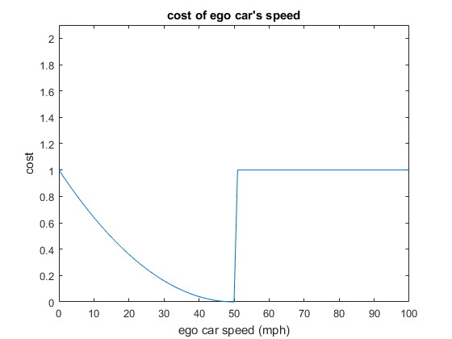

**Path Planning Project**


The goals / steps of this project are the following:

* to keep inside its lane, avoid hitting other cars
* to pass slower moving traffic all by using localization, sensor fusion, and map data.

## [Rubrics Points](https://review.udacity.com/#!/rubrics/1020/view) 

### 1. Statement of the problem
We are supposed to feed the simulator with a set of points per cycle (50 points for every 0.02 s) so that a car gets timely control of velocity on a certain lane. The ego car runs along one of the 3 lanes on the right hand side of the road, and tries to maintain a speed close to the speed limit 50 mph. If there is another car in front of its current lane, it tries to safely move to another lane which can runs faster. It also remains comfortable with acceleration and jerk not too high.

* Input
A highway map provides coordinates of the points at the double yellow line in middle of the highway. The total length is 6946 m. The car starts from the red point and runs anti clock wise. The maps coordinates are given by reading a file.


The ego car's current state (coords in xy and Frenet, yaw, and speed), and the car's previous path, and the environmental cars' states (id, coords in xy and Frenet, and velocity) are fed in by the simulator every cycle.

* Output
A set of points coordinates (next_x_vals and next_y_vals) in the next coming cycle (0.02 s) in xy coordinate system.

## 1. The code compiles correctly.
The code compiles successfully and generate the object file.

## 2. Valid trajectories
### The car is able to drive at least 4.32 miles without incident..

The car runs for 6.71 miles without incident.


### The car drives according to the speed limit
Please refer to the picture above. The car's speed averages at 46 mph.

### Max Acceleration and Jerk are not Exceeded
The acceleration is always below 10m/s2, and the jerk's always below 10m/s^3;

### Car does not have collisions
The car never collides with other cars.

### The car stays in its lane, except for the time between changing lanes
The car stays in its lane, 

### The car is able to change lanes
The car will turn to a nearby car when a car in front of it is too slow, or a car behind it is too fast. It only change lanes when it wants to maintein a higher yet below limit speed, and keeps safe.

## 3. Model documentation
###  Move the car 
To get a smooth control, use spline to generate a smooth trajectory with 5 points: previous two points as a start, and 3 points ahead with 30m in gap (line 445-492). Then the code uses the points in history, and fill in 30m ahead with up to 50 points that fall in the spline curve (line 495-529). 

The coordinates are transformed into Frenet to generate spline (line 484-488,513-514, and transformed back to xy coords (line 516-524).

The code where the car can change lanes is here, with "lane" can be set in each cycle.
```
vector<double> next_wp0 = getXY(car_s+30, (2+4*lane), map_waypoints_s, map_waypoints_x, map_waypoints_y);
vector<double> next_wp1 = getXY(car_s+60, (2+4*lane), map_waypoints_s, map_waypoints_x, map_waypoints_y);
vector<double> next_wp2 = getXY(car_s+90, (2+4*lane), map_waypoints_s, map_waypoints_x, map_waypoints_y);
```
The code that reflected updated velocity is here:
```
double N = target_distance/(0.02 * ref_vel/2.24);  
```

### Change lane and control speed
Any time the ego vehicle approaches a car in front of it that is moving slower than the speed limit, the ego vehicle should consider changing lanes.

The car should only change lanes if such a change would be safe, and also if the lane change would help it move through the flow of traffic better. 
The logic is listed below.

Lane | Check car s | Check car v | cost                | Action
-----|-------------|-------------|---------------------|-----------|
Ego car's lane | s>s_ego+30 |    | 0                   |           |
Ego car's lane   | s_ego<s<s_ego+30 |      | Vcost(v_ego-dv,v_goal)+(1-(s-s_ego)/30)+(v_ego-v)/v_ego| v_ego-=dv |
Ego car's lane   | s_ego-30<s<s_ego | v>v_ego | Vcost(v_ego+dv,v_goal)+(1-(s_ego-s)/30)+(v-v_ego)/v_ego| v_ego+=dv |
Ego car's lane   | s< s_ego | v<v_ego | 0 |     |
Neighboring lane | s>s_ego+30 |    | 0                   |           |
Neighboring lane | s_ego<s<= s_ego+30 |     | Vcost(v_ego-dv,v_goal)+(1-(s-s_ego)/30)+(v_ego-v)/v_ego | v_ego-= dv |
Neighboring lane | s_ego-30<s<=s_ego  | v>v_ego | Vcost(v_ego+dv,v_goal)+(1-(s_ego-s)/30)+(v-v_ego)/v_ego | v_ego+=dv|

In the current lane, the car will increase its speed if it runs below speed limit and there is no car closely in front of it. If there is a car closely in front of it, it will calculate costs of:
(1) decrease its speed by dv = 0.224 (ie. 0.1 mph)
(2) move to left lane when available, and increase or decrease according to the traffic in that lane
(3) move to right lane when available, and increase or decrease according to the traffic in that lane

The cost falls into 3 categories, each has a max of 1: 
* _Difference of ego car's speed from speed limit_ 

The cost is higher when the ego car runs too slow, and will turn 1 when it exceeds the limit (line 183-196)



* _Closeness in speed with cars in the front or in the back_

If the check car is in front of the ego car within 30m, the slower the front car (speed v), the more dangerous. So the ego car will slower the speed and  
```
cost = (egoSpeed - checkSpeed)/egoSpeed
```
If the check car is in the back of the ego car within 30m, the faster the front car (speed v), the more dangerous. so the ego car will increase the speed and 
```
cost = (checkSpeed-egoSpeed)/egoSpeed.
```
If the front check car is faster than the ego car, or the back check car is slower than the ego car, it diminishes the danger (negative cost).

* _Closeness in distance with cars in the front or in the back_

The closer the check car to the ego car, the more dangerous and more cost.
```
cost = 1 - |checkcarS- egocarS |/safe_dist;
```

The later 2 categories are only calculated when the check car is within the safe distance (30m).

When the ego car decreases its speed, only first cost is calculated. When the ego change lanes, all 3 costs are calculated. Then the costs are compared, and the ego car chooses a lane with lower cost and adjust the speed as well (line 323-435).


