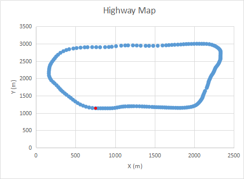
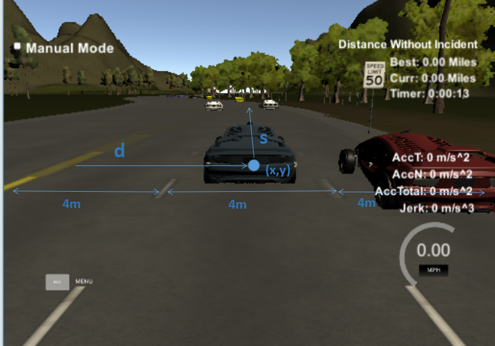

**Path Planning Project**

The goals / steps of this project are the following:

* to keep inside its lane, avoid hitting other cars
* to pass slower moving traffic all by using localization, sensor fusion, and map data.

## [Rubrics Points](https://review.udacity.com/#!/rubrics/1020/view) 

### 1. Statement of the problem
We are supposed to feed the simulator with a set of points per cycle (50 points for every 0.02 s) so that a car gets timely control of velocity on a certain lane. The ego car runs along one of the 3 lanes on the right hand side of the road, and tries to maintain a speed close to the speed limit 50 mph. If there is another car in front of its current lane, it tries to safely move to another lane which can runs faster. It also remains comfortable with acceleration and jerk not too high.

* Input
A highway map provides coordinates of the points at the double yellow line in middle of the highway. The total length is 6946 m. The car starts from the red point and runs anti clock wise.

